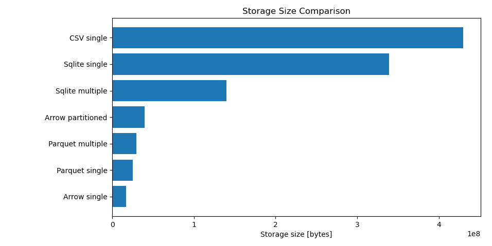
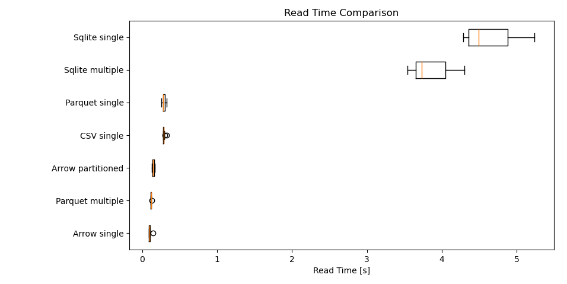
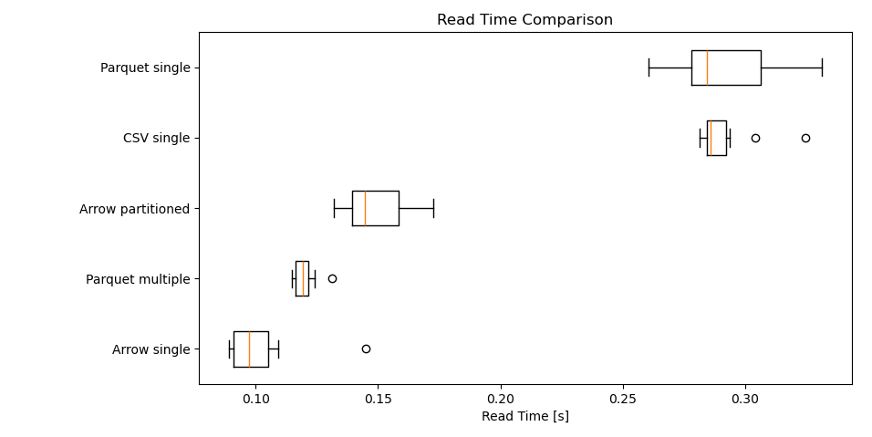

# Abaqus Automation

The goal of this project is to automate the creation and execution of Abaqus simulations.

# Usage

## Prerequisites

The following prerequisites need to be met to use this project:
- Abaqus installed and licensed
- Python 3.10 installed with the packages:
    - numpy
    - polars
    - pyarrow
    - matplotlib

## Job Execution

1. Place a [template](#templates) of the job script inside the `template` directory
2. Change the placeholders and replacement values inside `src/main.py`
3. Run the python script with `python src/main.py` 

## Data Extraction

1. Change the file path of the `.odb` file inside `src/data_extraction.py`
2. Modify the extraction data inside `src/data_extraction.py`
3. Run the python script with `python src/data_extraction.py`

# Background

## Templates

The automation script allows modifying Abaqus job scripts before execution in a programmatic manner.

The job scripts are placed in the `template` directory of this project.
The template is read by the automation script before the simulation is started and all placeholders are replaced by predefined values.
The placeholders and replacement values are defined in the file `src/main.py`, where they can be easily changed.
For examples, it is possible to automaticlly insert custom material parameters or add random variance to the model.

```python
# Using material parameters defined in a seperate file
def run_sim(settings: SimSettings):
    script = read_file(template_path)
    material_file = 'my_material.csv'
    script = script.replace('material_path', 'materials/'+material_file)
    write_file(script_path, script)
```

Additionally, the automation script removes all previous job submission commands from the template and inserts a new submission command at the end.
The parameters for the job submission are also defined in the file `src/main.py`, where they can be changed.

```python
def main() -> None:
    settings = SimSettings(
        job_name='test',
        script_path='script/test.py',
        input_path='test.inp',
        num_cpus=1,
        num_gpus=0,
        mem_size_mb=4000,
        scratch_path='',
    )
    run_sim(settings)
```

After all replacements are done, the final job script is saved to the directory `scripts` and the simulation is started.

## Data Extraction

Abaqus stores the simulation data in `.odb` files.
Since they require an Abaqus license to open, we provide a script to extract data to a `.json` file.
The JSON file perserves the nested structure of the `odb` file.

Not everything gets extracted by the script.
The extraction data is defined in the file `src/data_extraction.py` and can be changed to fit specific requirements.

# Storage Format Benchmarks

When storing large amount of data from multiple simulations, the JSON format is a bad choice, not only with respect to storage size, but also reading times.
We performed a series of experiments to determine a better storage format for FEM data.

We compared the following file-based formats:
- Sqlite
- CSV
- Parquet
- Apache Arrow

Additionally, we tested three different storage layouts:
- Single: The whole data is stored in a single table. This is simple, but also contains lots of duplicated information.

    | step_name | frame_num | type_name | val1 | val2 | val3 | val4 | val5 | val6 |
    | --- | --- | --- | --- | --- | --- | --- | --- | --- |
    | "Down" | 0 | "Stress" | 10 | 5 | 3 | 4 | 1 | 0 |
    | "Down" | 0 | "Force" | 10 | null | null | null | null | null |
    | "Down" | 1 | "Stress" | 13 | 4 | 5 | 5 | 0 | 1 |
    | "Down" | 1 | "Force" | 15 | null | null | null | null | null |
    | "Up" | 0 | "Stress" | 9 | 3 | 2 | 3 | 0 | 0 |
    | "Up" | 0 | "Force" | 3 | null | null | null | null | null |
    | "Up" | 1 | "Stress" | 4 | 0 | 1 | 3 | 9 | 0 |
    | "Up" | 1 | "Force" | 1 | null | null | null | null | null |

- Multiple: The data normalized and split into multiple tables. This eliminates duplicate information, but makes working with the data more complex.

    | step_id | step_name |
    | --- | --- |
    | 0 | "Down" |
    | 1 | "Up" |

    | type_id | type_name |
    | --- | --- |
    | 0 | "Stress" |
    | 1 | "Force" |

    | frame_id | step_id | frame_num |
    | --- | --- | --- |
    | 0 | 0 | 0 |
    | 1 | 0 | 1 |
    | 2 | 1 | 0 |
    | 3 | 1 | 1 |

    | node_id | frame_id | type_id | val1 | val2 | val3 | val4 | val5 | val6 |
    | --- | --- | --- | --- | --- | --- | --- | --- | --- |
    | 0 | 0 | 0 | 10 | 5 | 3 | 4 | 1 | 0 |
    | 1 | 0 | 1 | 10 | null | null | null | null | null |
    | 2 | 1 | 0 | 13 | 4 | 5 | 5 | 0 | 1 |
    | 3 | 1 | 1 | 15 | null | null | null | null | null |
    | 4 | 2 | 0 | 9 | 3 | 2 | 3 | 0 | 0 |
    | 5 | 2 | 1 | 3 | null | null | null | null | null |
    | 6 | 3 | 0 | 4 | 0 | 1 | 3 | 9 | 0 |
    | 7 | 3 | 1 | 1 | null | null | null | null | null |

- Partitioned: Apache Arrow provides the option, apply a specific paritioning scheme for data storage. For the benchmarks, the partiioning columns `step_name` and `type_name` is selected.

## Storage Size

The following figure shows the storage size for the same simulation data in different storage formats.



On the lower end, we can see, that Apache Arrow slightly outperforms the Parquet data format.
In both cases, only using single table beats the approach of splitting up the data.
For this example this makes sense, since storing all the relationships between tables requires more information than simply duplicating the data.

## Reading Times

The benchmarks measuring the reading times are specifically designed with machine learning in mind.
What gets evaluated is the access of all nodes for random simulation frame, but only for a specific value type and simulation step.
This emulates the process repeatedly selecting random training data for machine learning purposes.

The following two figures show the results of the data reading benchmark.
The first image compares all methods, while the second focuses only on the better performing storage formats.





Also for this experiment, a single Apache Arrow table comes out on top.
In this benchmark, using multiple tables shows some advantages over a single table.

We conclude, that using Apache Arrow with a single table is the best storage format for our application.
